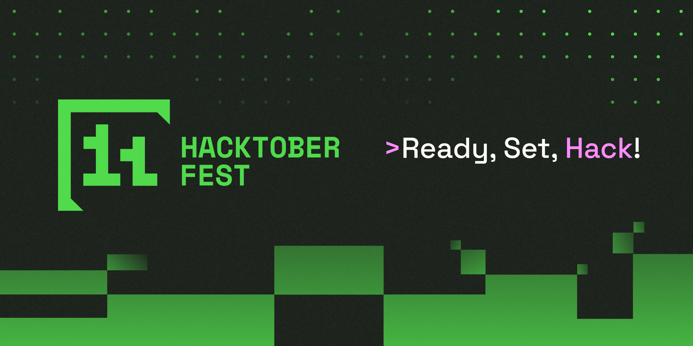
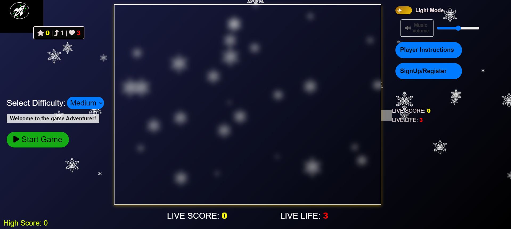
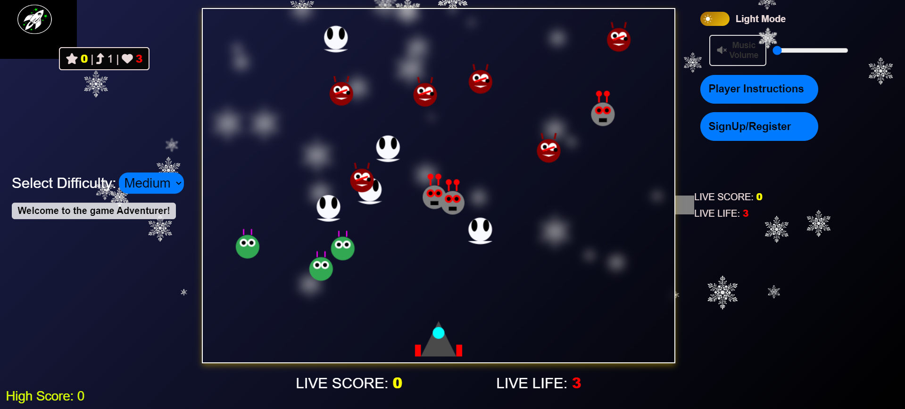

# 🚀 **Alien Invasion Defense 🛸**

**Welcome to Alien Invasion Defense, a fast-paced space shooting game! Defend your base from waves of alien invaders and become the ultimate space defender. 🌌 With simple controls, sleek graphics, and exciting gameplay, get ready for an epic battle. Use your weapons to destroy alien ships, survive multiple waves, and protect your base with 3 lives. 👾**

---

<table align="center">
    <thead align="center">
        <tr border: 1px;>
            <td><b>🌟 Stars</b></td>
            <td><b>🍴 Forks</b></td>
            <td><b>🐛 Issues</b></td>
            <td><b>🔔 Open PRs</b></td>
            <td><b>🔕 Close PRs</b></td>
            <td><b>🛠️ Languages</b></td>
            <td><b>🌐 Contributors </b></td>
        </tr>
     </thead>
    <tbody>
         <tr>
            <td></td>
            <td></td>
            <td></td>
            <td></td>
           <td></td>
           <td></td>
           <td></td>
        </tr>
    </tbody>
</table>
---

## Table of Contents

1. [Featured In](#featured-in)
2. [Features](#-features)
3. [How To Play](#-how-to-play)
4. [Game Rules](#-game-rules)
5. [Tech Stack](#tech-stack)
6. [Play Locally](#-how-to-play-locally)
7. [Contributing](#contributing)
8. [Our Contributors](#️-our-valuable-contributors)
9. [Stargazers](#stargazers)
10. [Forkers](#forkers)
11. [Website Preview](#website-preview)
12. [Code of Conduct](#code-of-conduct)
13. [License](#license-)
---

## Featured In
<table>

   <tr>
      <th>Event Logo</th>
      <th>Event Name</th>
      <th>Event Description</th>
   </tr>
   <tr>
      <td></td>
      <td>GirlScript Summer of Code 2024</td>
      <td>GirlScript Summer of Code is a three-month-long Open Source Program conducted every summer by GirlScript Foundation. It is an initiative to bring more beginners to Open-Source Software Development.</td>
   </tr>
    <tr>
      <td></td>
      <td>Hacktoberfest 2024</td>
      <td>Hacktoberfest is a month-long celebration of open source software run by DigitalOcean, GitHub, and Twilio. It encourages contributions to open source projects and promotes a global community of developers.</td>
   </tr>

</table>
---

# 🌟 Features
- ✨ **Exciting Alien Invasion Gameplay**: Fight waves of alien ships attacking your base.
- 🎮 **Easy Controls & Interface**: Restart the game, track your score, and see your remaining lives in an easy-to-use side panel.
- 💥 **Three Lives**: Defend your base with only 3 chances!
- 🚀 **Smooth Shooting**: Enjoy responsive shooting to destroy the alien invaders.
- 🖥️ **Modern Graphics**: Simple and clean interface that looks great.
- 🔄 **Quick Restart**: Restart the game instantly with one click.
- 🏆 **Leaderboard (Optional)**: Track your highest scores and compete with others.

---

# 🎮 How to Play
1. **Start the Game**: Click the "Start" button to begin.
2. **Move and Shoot**: Use your keyboard or on-screen controls to move your spaceship and shoot at alien ships.
3. **Lives**: You have 3 lives. You lose a life if an alien reaches your base or if your ship is hit.
4. **Game Over**: When you lose all 3 lives, the game ends. Click "Restart" to try again.
5. **Progress**: Destroy all alien ships in each wave to move on to the next level and increase your score.

---

# 📜 Game Rules
- **Survive as long as you can** by shooting alien ships and protecting your base.
- **3 Lives Only**: If aliens reach your base or hit your ship 3 times, the game ends.
- **Restart Anytime**: Use the "Restart" button to start over.
- **Earn Points**: Destroy alien ships to get points. Aim for the highest score before losing all your lives!

---
## <p style="font-family:var(--ff-philosopher);font-size:3rem;text-align:center;">Tech Stack</p>
<a href="https://developer.mozilla.org/en-US/docs/Glossary/HTML5">  </a> <p>HTML5 structures the website's content, enabling modern multimedia support and semantic layout.</p><br> <a href="https://developer.mozilla.org/en-US/docs/Web/JavaScript">  </a> <p>JavaScript adds interactivity, making the site dynamic with features like form validation and real-time content updates.</p><br> <a href="https://developer.mozilla.org/en-US/docs/Web/CSS">  </a> <p>CSS3 styles the website, enhancing its appearance and ensuring an adaptive layout.</p>
---

## 🚀 How to Play Locally
To play this game on your own computer:

1. **Clone the Repository**:
   ```bash
   git clone https://github.com/YOUR_GITHUB_USERNAME/Alien-Invasion-Defense.git

2. **Create a new branch**:
   ```bash
   git checkout -b feature-branch

3. **Push to your branch**:
   ```bash
   git push origin feature-branch

4. Open a pull request to the main repository.

---

## <p style="font-family:var(--ff-philosopher);font-size:3rem;text-align:center;"> Contributing </p>

<p style="font-family:var(--ff-philosopher);font-size:2rem;">We appreciate your feedback! Our goal is to make contribution to this project as easy and transparent as possible. Whether you're interested in:</p> <ul style="font-size:1.5rem;"> <li>  <strong>Reporting a bug</strong> </li> <li>  <strong>Discussing the current state of the code</strong> </li> <li>  <strong>Submitting a fix</strong> </li> <li>  <strong>Proposing new features</strong> </li> </ul> <p style="font-size:1.5rem;">To get started with contributing, please follow the steps outlined in the <a href="Contributing.md" style="color: #007bff; text-decoration: none;">Contributing.md</a>.</p>
---

## ❤️ Our Valuable Contributors
[](https://github.com/YadavAkhileshh/Alien-Invasion-Defense/graphs/contributors)

---

## Stargazers

<div align='center'>

[](https://github.com/YadavAkhileshh/Alien-Invasion-Defense/stargazers)

</div>

---

## Forkers
<div align='center'>

[](https://github.com/YadavAkhileshh/Alien-Invasion-Defense/network/members)

---
## Website Preview



🌐 **Visit our website:** [Alien Invasion](https://alienid.netlify.app/)
---

## Code of Conduct
We are committed to fostering a welcoming and inclusive environment for everyone. All contributors and participants are expected to uphold the following values:

- Be respectful of different viewpoints and experiences.
- Show empathy toward others.
- Use inclusive language.

Please read and follow our [Code of Conduct](Code_Of_Conduct.md) to foster an inclusive community.
If anyone violates these standards, they may be banned from the community.

---

## License 📜 

This project is licensed under the MIT License. For more details, see the [LICENSE](LICENSE) file.

---

<div align="center">
    <a href="#top">
        
    </a>
</div>

---

<center>
<h3 style="font-size:2rem;">
If you find this project helpful, please consider giving it a star! </p>
</center>

---
# <p align="center">Made with ❤️ for all space defenders!</p>
---